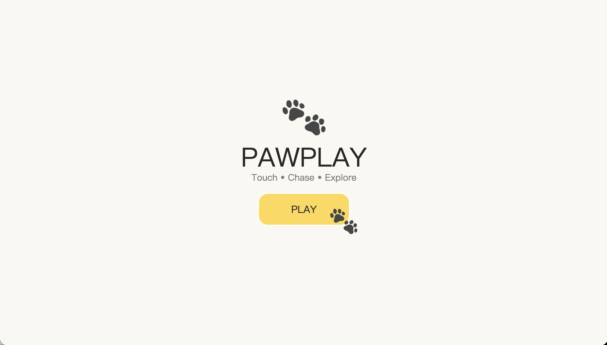
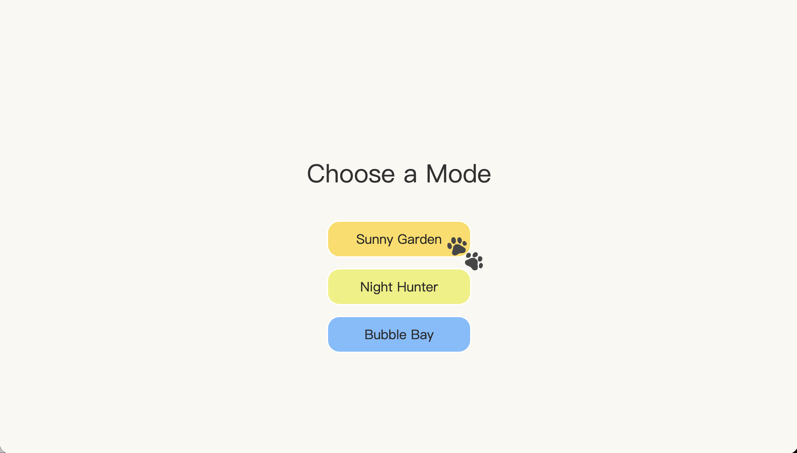
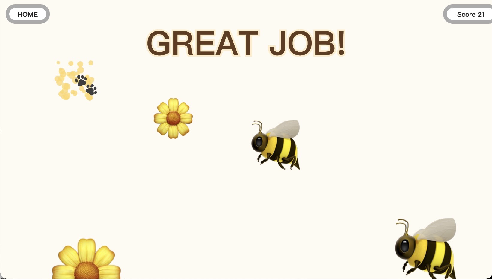

# PAWPLAY 🐾

## IDEA9103 Creative Coding Final Project

An interactive touch-based game designed for pets, inspired by enrichment toys and playful animal interactions.

---

# Team Members

| Name         | Mechanic                  |
| ------------ | ------------------------- |
| Fanfei Li    | User Input                |
| Sylvie Chen  | Time-Based & Audio        |
| Wenjia Jiang | Perlin Noise & Randomness |

---

# Project Overview

PAWPLAY is an interactive game designed primarily for pets. Players (or pets) interact with moving visual targets by touching or clicking them. Successful interactions trigger sound effects, particle animations, score increases, and achievement messages.

The project aims to create an engaging and playful digital experience that combines visual stimulation, movement, sound, and reward systems.

---

# Screenshots

## Home Screen



The landing page introduces the game and allows users to begin the experience.

---

## Mode Selection



Players can choose between three different environments:

* Sunny Garden
* Night Hunter
* Bubble Bay

---

## Gameplay


Moving targets appear on screen and can be clicked or touched to earn points.

---

## Achievement System



Players receive visual feedback and rewards after reaching score milestones.

---

# Inspiration

PAWPLAY was inspired by pet play behaviours and digital touch-based games. The project translates activities such as chasing, tracking, and touching moving objects into an interactive experience for pets. Movement, sound, and pet-friendly colours are used to encourage engagement and play.

---

# Techniques

The project was developed using p5.js and incorporates a range of techniques explored throughout the semester.

### Visual Techniques

* Animated objects
* Particle effects
* State-based screen navigation
* Responsive full-screen layout

### Interaction Techniques

* Mouse and touch interaction
* Object collision detection
* Scoring system
* Achievement feedback

### Generative Techniques

* Random object generation
* Random spawning positions
* Random movement velocities
* Perlin noise drifting motion

### Audio Techniques

* Sound effect playback using p5.sound
* Audio feedback triggered by user interaction

---

# Mechanic Ownership

## Fanfei Li — User Input

Responsible for all interaction mechanics.

Features include:

* Play button interaction
* Menu navigation
* Mode selection
* Object clicking/touching
* Score triggering

Implemented in:

```text
input.js
```

---

## Sylvie Chen — Time-Based & Audio

Responsible for timing systems and audio feedback.

Features include:

* Timed object spawning
* Achievement timers
* Audio playback
* Sound feedback

Implemented in:

```text
timeAudio.js
```

---

## Wenjia Jiang — Perlin Noise & Randomness

Responsible for procedural movement and visual variation.

Features include:

* Random object generation
* Random movement behaviours
* Perlin noise drifting motion
* Particle explosion effects

Implemented in:

```text
perlinRandom.js
```

---

# Interaction Instructions

1. Open the project in a browser.
2. Click the PLAY button.
3. Select a game mode.
4. Click or touch moving objects.
5. Earn points and trigger achievements.
6. Return to the menu using the HOME button.

---

# Repository Structure

```text
index.html
style.css

sketch.js
input.js
timeAudio.js
perlinRandom.js

library/
├── pop.mp3
├── home.png
├── menu.png
├── sunny garden.png
├── night hunter.png
└── bubble bay.png

README.md
```

---

# AI Acknowledgement

ChatGPT was used to assist with:

* Debugging code
* Code organisation and refactoring

All generated code was reviewed, tested, modified, and integrated by the project team.


---

# External References

### p5.js Reference

https://p5js.org/reference/

Used for implementing animation, interaction, sound, and visual effects.

### p5.sound Library

https://p5js.org/reference/#/libraries/p5.sound

Used for audio playback functionality.

### Pixabay Sound Effects

https://pixabay.com/sound-effects/

Source of the click/pop sound effect used in the project.

---

# Future Improvements

Potential future developments include:

* Touchscreen optimisation for tablets
* Additional game modes
* Adaptive difficulty systems
* More varied visual targets
* Additional sound and reward systems

---
